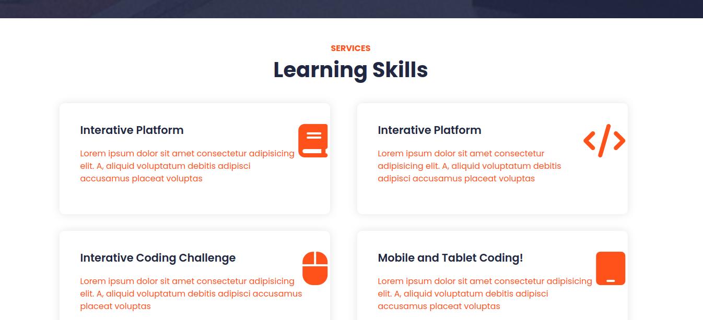

# Ed-Tech Responsive Website

This is a responsive Ed-Tech website designed using **HTML**, **CSS**, **Bootstrap**, and **Images**. The website offers an engaging and interactive user interface that adapts seamlessly across various screen sizes, making it accessible on both desktop and mobile devices.

if you want visit Ed-Tech Project, please click here

[click here](https://rahulchoudhuri.github.io/Ed_Tech-landing-page/)

## project screenshots





## Features

- **Responsive Design**: Built with Bootstrap to ensure the website is fully responsive and adapts to different screen sizes.
- **Modern UI**: Clean and user-friendly interface that is easy to navigate.
- **Interactive Sections**: Includes sections for courses, instructors, and student resources.
- **Cross-Browser Compatibility**: Works well on all modern browsers like Chrome, Firefox, Safari, and Edge.
- **Images and Media**: Uses images and icons to enhance the visual appeal of the site.
- **Educational Content**: Provides resources for students and instructors.

## Installation

To run the project locally, follow the steps below:

1. **Clone this repository** to your local machine using the following command:
   ```bash
   git clone https://github.com/RahulChoudhuri/Ed_Tech-landing-page.git

2. **Navigate to the project folder:**
    ```bash
    cd ed-tech-website
    ```

3. **Open the HTML file in any web browser to view the website.** 
    For example:
    + index.html

## Technologies Used

- **HTML:** For the structure and content of the website.
- **CSS:** For styling the website and ensuring responsiveness.
- **Bootstrap:** For grid system, responsive design components, and pre-built styles.
- **Images:** High-quality images and icons to enhance the design.

## Project Structure
```bash
ed-tech-website/
│
├── index.html       # Main HTML file
├── assets/          # Folder containing images,   fonts, etc.
│   ├── img/         # Images for the website
│   
├── css/             # Custom CSS file
└── README.md        # This file
```

## Contributing
 If you'd like to contribute to this project, follow these steps:

1. Fork the repository.
2. Create a new branch (git checkout -b feature-branch).
3. Make your changes.
Commit your changes (git commit -am 'Add new feature').
4. Push to the branch (git push origin feature-branch).
5. Create a pull request.

## License
This project is licensed under the MIT License - see the LICENSE file for details.

## Acknowledgments
 - Thanks to Bootstrap for providing a responsive framework.
 - The images and icons used in the website are  sourced from Unsplash and FontAwesome.
